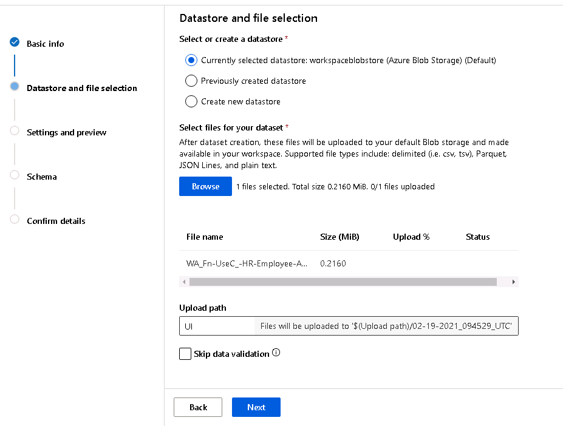
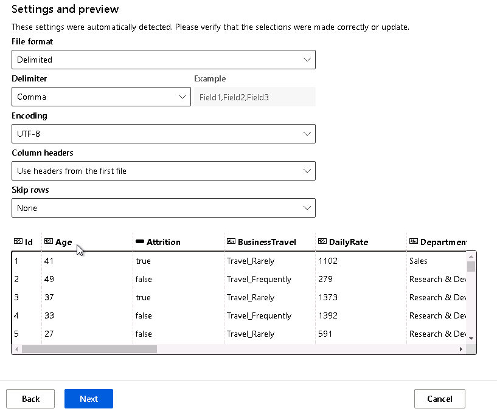
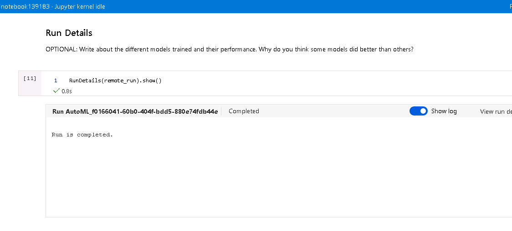
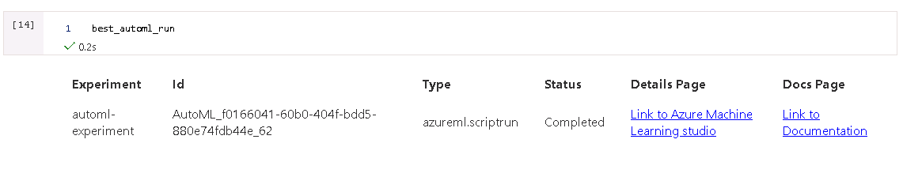
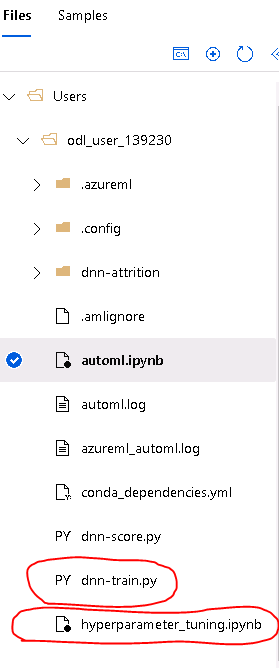
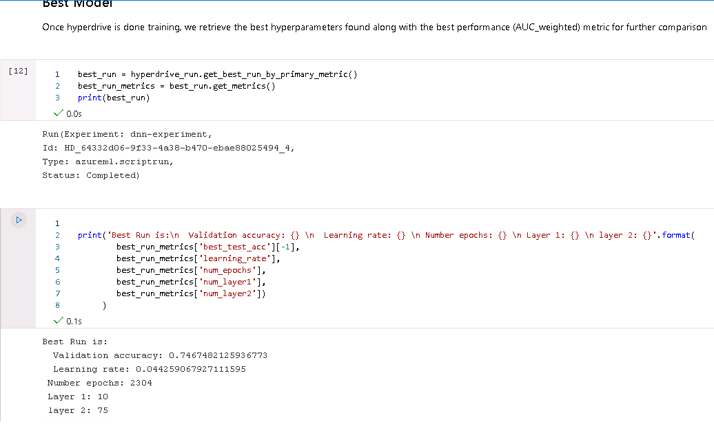
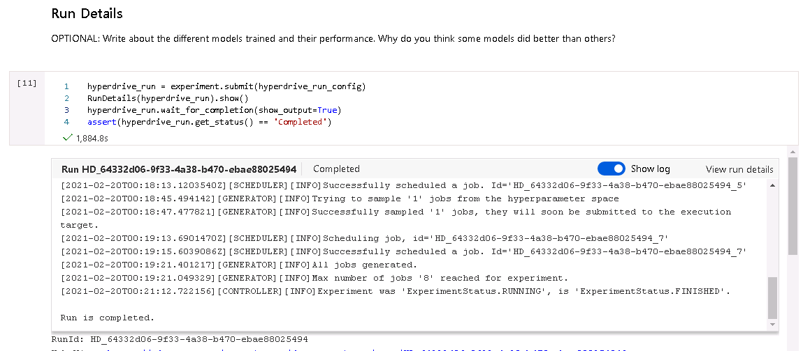
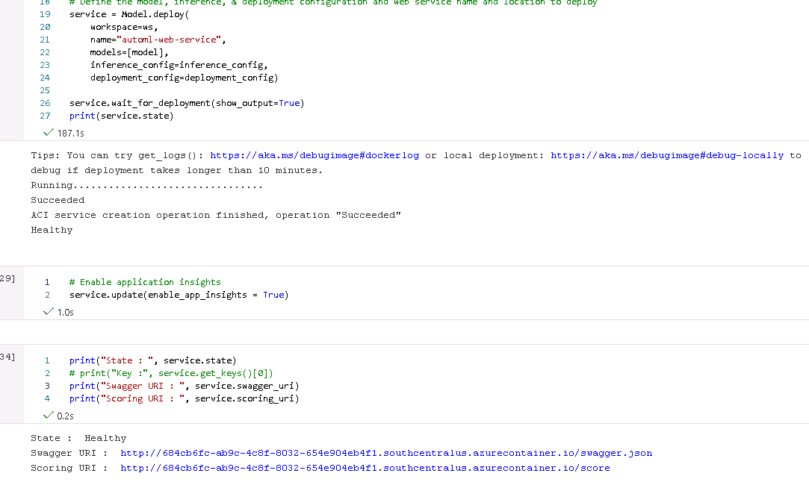

# Employee attrition prediction project

This project consist in comparing and selecting between 2 different approaches to solve a usual problem of best model selection. The dataset selected for this project will be the *employee attrition* dataset, a toy dataset made by the IBM data scientists with the purpose of predictor's explanation. For more info about this dataset you can follow this [link](https://www.kaggle.com/pavansubhasht/ibm-hr-analytics-attrition-dataset).

The workflow of this project will be the following: First upload the dataset of employee attrition into the azureml workspace. Use hyperdrive (fixed model/moving hyperparameters) and automl (moving model/moving hyperparameters) with the data attrition dataset and compare the best performing models resulting of both azure ml tools. Register, deployment and consumption of such model will be followed once the best performing model is identified.


## Dataset

### Overview
The dataset used for this project is the employee attrition dataset, from kaggle; The dataset is completely simulated, so there is no violation to individual's right to privacy.

This dataset is formed of 35 columns: 26 integer columns, 6 categorical columns and 3 binary columns which simulates traits for each employee. Each row represents a different employee.

### Task

The main objective is to find relations between the dependent variable (**Attrition**) and the remaining columns given a predictor's vector and maybe identify which columns have more influence in the predicted result.

### Load the dataset

First, a dataset different than the current ones that exist in azureml has to be stored & loaded. In order to do this we use the azure portal to load the attrition dataset. Under the *datasets* section we select to create a new dataset with the name of *attrition-dataset* and specify some needed attributes for such dataset.



This part is also useful to check that the correct data type was assigned to each column:



### Access the dataset

To access the dataset from the notebook we have to use the *get_by_name* method from the Dataset class. This cell is present in both notebooks.

```python
ibm_ds = Dataset.get_by_name(ws, 'attrition-dataset')
```

After executing this cell a TabularDataset object is returned. This dataset will be necessary when training and consuming our future model/endpoint.

## Automated ML

Given the tabular nature of the selected dataset: categorical and numeric columns are present, relatively few observations with respect the number of columns, the following settings were selected in the automl configuration:

- *iteration_timeout_minutes* to 30, just to make sure the experiment will finish in a feasible time
- *enable_early_stopping* to True in order to not waste resources when the model performance is not improving anymore
- *primary_metric* "AUC_weighted" given we are facing an umbalanced class problem. click [here](https://scikit-learn.org/stable/modules/generated/sklearn.metrics.roc_auc_score.html) for more info.
- *verbosity* logging.INFO to capture important events for the model experiments
- *max_concurrent_iterations* to 5 in order to parallelize experimentation
- *n_cross_validations* to 5 to give an estimated 80-20 proportion to the training-testing sets in each fold. Though, maybe more folds could be suggested due the lack of observations in the dataset
- *task* will be "classification" because the objective is to identify attrition as a "Yes", "No" labeling problem 

### Results

The results reported by  automl gives a Voting Ensemble model with best a *AUC_weighted* of 0.8427 (this result may vary for each automl experiment run)

```
ITERATION   PIPELINE                                DURATION      METRIC      BEST
62    VotingEnsemble                                0:01:57       0.8427    0.8427
```

What it can be seen is that automl obtains consistently superior results compared with the ones obtained with hyperdrive, showing that there exists better approaches than DNN to model this kind of data.



You can inspect the experiment run in detail using azureml portal, where each of the runs is listed with their respective metric



#### Best model parameters

```
min_weight_fraction_leaf=0.0,
n_estimators=100,
n_jobs=1,
oob_score=False,
random_state=None,
verbose=0,
warm_start=False
```

#### Best model environment

You can find more details of the resulting automl model, such as *feature importance* in the *automl.ipynb* file.

After automl is done with model/hyperparameter search, the model with the best performance metric is selected. The results obtained with automl outperforms the ones found using *hyperdrive* so, for the deployment section the automl model will be used.

## Hyperparameter Tuning

**NOTE**: Before running the hyperdrive experiment, make sure that you have *hyperparameter_tuning.ipynb*, *dnn-score.py* and *dnn-train.py* on the same level. Otherwise, a not file found error will show.



Due the hyperparameter tuning section supposes a fixed model; a PyTorch DNN with 2 hidden layers was selected. The selection of a PyTorch model was just for didactic purposes. This also is a wonderful moment to try a compute cluster that actually supports GPU computing. For hyperparameter optimization the following settings were selected:

- *num_epochs* to determine the training cycles for the DNN in order to achieve the best performance and avoid overfitting.
- *learning_rate* is the initial learning hyperparameter in order to reduce the grandient values by a small leap factor (here, we are using Adam optimizer. This substracts importance to the search of this term but nonetheless is a useful point to start)
- *num_layer1* is for determining the number of neurons for the first hidden layer of the DNN
- *num_layer2* is to determine the second hidden layer of the DNN neuron number

The following cell is used to log the hyperparameters mentioned above.

```python
run.log("num_epochs", np.int(num_epochs))
run.log("learning_rate", np.float(learning_rate))
run.log("num_layer1", np.int(num_layer1))
run.log("num_layer2", np.int(num_layer2))
```

In terms of performance metric we are using the same used for the automl experiment.

```python
run.log('best_test_acc', np.float(best_metric))
```

The above cell logs the obtained metric per epoch with label *best_test_acc*.

For hyper-parameter search, it is defined in the following code snippet. We use *BayesianParameterSampling* for hyperparameter search. For this specific sampling it's not needed to define a stop policy. The default arguments are applied. 

Due the nature of the selected hyper-parameters to search de following ranges were selected:

```python
param_sampling = BayesianParameterSampling({
    "learning_rate": uniform(0.001, 0.1),
    "num_epochs": choice(range(100, 5000)),
    "layer1": choice(range(10, 100)),
    "layer2": choice(range(10, 100)),
})
```

Note that for continuous value search the *uniform* distribution distribution is used. For integer distributions the *choice* funtion with the *min* to *max* range is passed. Click [here](https://docs.microsoft.com/en-us/azure/machine-learning/how-to-tune-hyperparameters#define-the-search-space) to know more about hyperparameter model tuning.

### Results

It is very important to note that some aspects of the dataset were neglected during this run, such as class imbalance. There exist many different approaches to solve this kind of problems like undersampling or oversampling methods (maybe including a specialized library for this task such as [imbalanced-learn](https://github.com/scikit-learn-contrib/imbalanced-learn)) or using a weighted loss function but for now it is not the scope of this project.

The results reported by the hyperdrive run experiment can be inspected with following code cell:

```python
print('Best Run is:\n  Validation accuracy: {} \n  Learning rate: {} \n Number epochs: {} \n Layer 1: {} \n layer 2: {}'.format(
        best_run_metrics['best_test_acc'][-1],
        best_run_metrics['learning_rate'],
        best_run_metrics['num_epochs'],
        best_run_metrics['num_layer1'],
        best_run_metrics['num_layer2'])
     )
```

The following is the corresponding output:

```
Best Run is:
  Validation accuracy: 0.7467482125936773 
  Learning rate: 0.044259067927111595 
 Number epochs: 2304 
 Layer 1: 10 
 layer 2: 75
```

For more details you can inspect the *hyperparameter_tuning.ipynb*.



Although the results were good the experiment was surpassed by the automl result with an *AUC_weighted* metric of **0.7467**. For that reason, the model selected for deployment will be the resulting from the automl selection process. Please inspect the *hyperparameter_tuning.ipynb* for more details.



## Model Deployment

Once the best performing model has been selected we can move on to deploy it. This part will be present in the *automl.ipynb* due its superior result.

### Registering the model

First we have to retrieve the best run/model from the AutoMLRun object. For this, use the *get_outputs()* method:

```python
best_automl_run, best_automl_model = remote_run.get_output()
```

Next download the inference script generated by the best model. The last line of the next cell denotes that we are downloading the best model script in the scoring path used at inference time.

```python
model_name = best_automl_run.properties["model_name"]
script_file_name = "inference/score.py"
best_automl_run.download_file('outputs/scoring_file_v_1_0_0.py', script_file_name)
```

In the next cell, we register and deploy the best model as an endpoint:

```python
description = 'sample service for Automl Classification'
model = best_automl_run.register_model(description = description,
                                       model_name=model_name,
                                       tags={'area': "Attrition", 'type': "automl_classification"},
                                       model_path = "outputs/model.pkl")

# Combine scoring script & environment in Inference configuration
inference_config = InferenceConfig(entry_script=script_file_name)

# Set deployment configuration
deployment_config = AciWebservice.deploy_configuration(cpu_cores=1, 
                                                       memory_gb=1,
                                                       tags={'area': "AttritionData", 'type': "automl_classification"},
                                                       description=description)

# Define the model, inference, & deployment configuration and web service name and location to deploy
service = Model.deploy(
    workspace=ws,
    name="automl-web-service",
    models=[model],
    inference_config=inference_config,
    deployment_config=deployment_config)

service.wait_for_deployment(show_output=True)
```

In the second cell line we register the model giving as arguments some necessary data such as the *model name* and optional data such as *description*. Next we instantiate an *InferenceConfig* class which combines the scoring script and the environment (if provided) with the inference configuration. For this deployment we use an Azure Container Instance (ACI) passing the number of cores and memory that will be used by the inference compute instance as the model *endpoint*. We also pass some optional arguments such as *tags* and *description*.

If everything goes as planned, the cell should return a healthy service endpoint. To see how the endopoint is tested please go to the *test* section of the *automl.ipynb* file.



## Future improvements

### Automl

### Hyperdrive

## Screen Recording

[Screencast link](https://youtu.be/Lp6bIqDVsQ4)


## References
<br>

- [Heart failure dataset](https://www.kaggle.com/andrewmvd/heart-failure-clinical-data/notebooks)
- [IBM attrition dataset](https://www.kaggle.com/pavansubhasht/ibm-hr-analytics-attrition-dataset)
- [PyTorch train/deploy](https://github.com/Azure/MachineLearningNotebooks/tree/master/how-to-use-azureml/ml-frameworks/pytorch/train-hyperparameter-tune-deploy-with-pytorch)
- [AUC weighted documentation](https://scikit-learn.org/stable/modules/generated/sklearn.metrics.roc_auc_score.html)
- [automl classification notebook](https://github.com/Azure/MachineLearningNotebooks/blob/master/how-to-use-azureml/automated-machine-learning/classification-bank-marketing-all-features/auto-ml-classification-bank-marketing-all-features.ipynb)
[Deploy machine learning models](https://docs.microsoft.com/en-us/azure/machine-learning/how-to-deploy-and-where?tabs=python)

### Udacity project examples
- [example 1](https://github.com/PamPijnenborg21/CapstoneProject)
- [example 2](https://github.com/singh2010nidhi/Heart-Failure-Prediction-using-MSAzure/blob/main/hyperparameter_tuning.ipynb)
